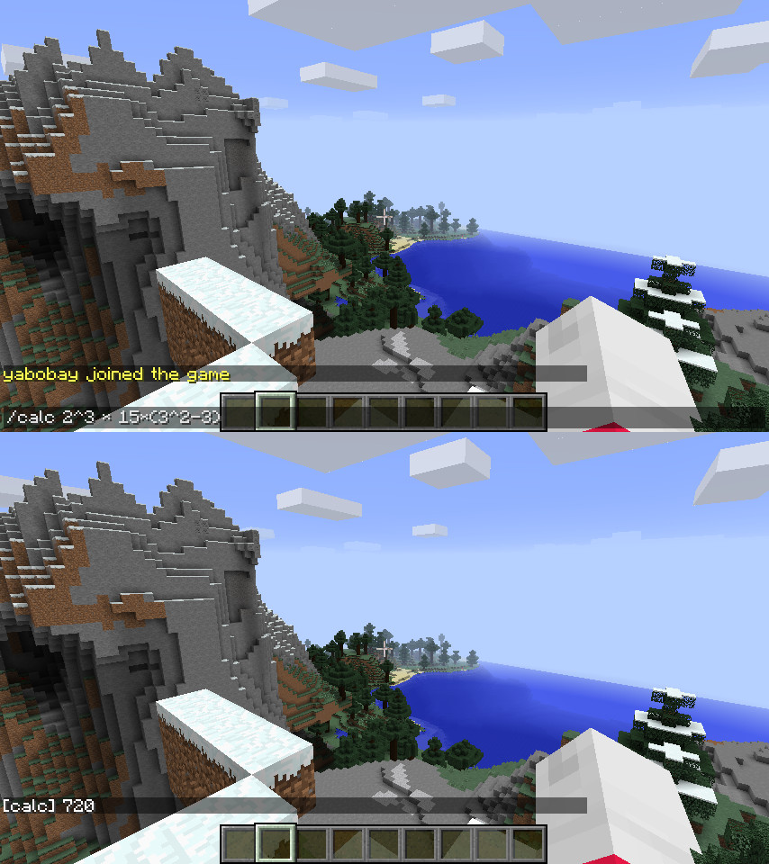

# Minecraft Calculator #



A Minecraft Java Edition server plugin that lets you use a calculator in-game to figure out how many blocks you need to build something.

## Building ##

Dependencies:
* Java 8 or newer
* Maven

```
mvn package
```

Then you will find two jars in `target/`, one with dependencies bundled and one without.

## Usage ##

Put it in the `plugins/` directory of your Bukkit-compatible Minecraft server!
